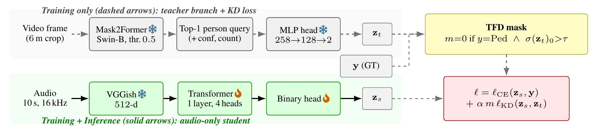

# Cross-Modal Knowledge Distillation for Acoustic Pedestrian Detection

<span style="white-space:nowrap;">[Yonghyun Kim](https://yonghyunk1m.notion.site/)<sup>1</sup></span>&nbsp;·
<span style="white-space:nowrap;">[Chaeyeon Han](https://bravoyourlif.github.io/)<sup>2</sup></span>&nbsp;·
<span style="white-space:nowrap;">[Sancho Gatungay](https://www.linkedin.com/in/sancho-gatungay/)<sup>3</sup></span>&nbsp;·
<span style="white-space:nowrap;">[Subhrajit Guhathakurta](https://resilience.research.gatech.edu/people/subhrajit-subhro-guhathakurta)<sup>2</sup></span>&nbsp;·
<span style="white-space:nowrap;">[Alexander Lerch](https://www.alexanderlerch.com/about/)<sup>1</sup></span>

<sup>1</sup> Music Informatics Group, Georgia Institute of Technology&nbsp;&nbsp;
<sup>2</sup> Center for Urban Resilience and Analytics, Georgia Institute of Technology&nbsp;&nbsp;
<sup>3</sup> College of Computing, Georgia Institute of Technology

Companion code for the paper of the same title, proposing **Trust-Filtered Distillation (TFD)**.

> **TL;DR.** We detect pedestrians from audio alone, using a video "teacher" only during training. The teacher raises the reported accuracy, but mostly by changing how often the model says "pedestrian," not by improving what it can actually detect.

<p align="center">
  
</p>

<p align="center"><em>System pipeline. A frozen video teacher (Mask2Former &rarr; MLP head) supervises the audio-only student (VGGish &rarr; Transformer) during training via the KD loss, gated per sample by the TFD mask (&tau;&nbsp;=&nbsp;0.4). Inference&nbsp;is&nbsp;audio-only.</em></p>

Audio-only pedestrian detection on [ASPED v.a](https://huggingface.co/datasets/urbanaudiosensing/ASPED) (urban pedestrian areas closed to vehicular traffic) via cross-modal knowledge distillation from a video teacher (Mask2Former) to an audio student (VGGish + Transformer). Under the dataset's severe class imbalance (91.5% no-pedestrian / 8.5% pedestrian-present), KD mostly shifts the student's operating point toward the majority class rather than improving discrimination. **Trust-Filtered Distillation (TFD)** gates the KD loss per sample, disabling it on the minority (pedestrian) samples whose teacher assigns majority-class probability above a threshold (τ = 0.4). Across the eleven-way LOSO comparison the two TFD variants show the largest standardized paired macro-accuracy effects (Cohen's *d* = 1.60 / 1.72); at five folds an exact two-sided sign-flip test cannot reach *p* < 0.05 (floor 0.0625), so we treat *d* and fold consistency as the primary evidence and report paired *t*-test *p* (0.033 / 0.026) only as a secondary indicator.

## Results — 5-fold LOSO (ASPED v.a)

Full aggregate in [`results/loso_aggregate_11method.csv`](results/loso_aggregate_11method.csv) (per-metric mean and std across the 5 folds).

| Method | Macro Acc | No-Ped | Ped | F1_Ped | PR-AUC | *d* | *p* |
|--------|:---------:|:------:|:---:|:------:|:------:|:---:|:---:|
| Baseline (CE only) | 72.9 ± 1.8 | 63.5 | 82.3 | 28.6 | .328 | – | – |
| LogitKD | 73.6 ± 1.7 | 70.8 | 76.4 | 31.2 | .332 | 1.17 | 0.079 |
| LogitKD (α=0.3) | 73.8 ± 1.9 | 70.3 | 77.2 | 30.9 | .326 | 1.36 | 0.053 |
| LogitKD + EMA loss-norm | 73.6 ± 1.9 | 68.5 | 78.7 | 30.4 | .324 | 1.15 | 0.083 |
| LogitKD + logit adjustment | 71.3 ± 2.1 | 53.7 | **89.0** | 25.9 | **.333** | −1.05 | 0.104 |
| LogitKD + Focal | 73.3 ± 2.0 | 65.2 | 81.4 | 29.3 | .329 | 0.56 | 0.324 |
| Cosine | 73.6 ± 1.7 | 67.4 | 79.8 | 30.1 | .327 | 1.04 | 0.106 |
| CRD | 73.2 ± 2.0 | 64.4 | 82.0 | 29.0 | .329 | 0.30 | 0.579 |
| RKD | 73.7 ± 1.6 | 67.3 | 80.1 | 30.0 | .327 | 1.08 | 0.096 |
| **LogitKD-TFD** | **73.7 ± 1.7** | 72.6 | 74.7 | **31.8** | .330 | 1.60 | **0.033*** |
| **Hybrid-TFD** | 73.6 ± 1.8 | **72.9** | 74.3 | 31.8 | .331 | **1.72** | **0.026*** |

Accuracies and F1 in percent, mean ± std across folds where shown; PR-AUC is a 5-fold mean. * marks *p* < 0.05 on paired per-fold *t*-tests against the baseline (a secondary indicator; see the sign-flip note above). PR-AUC stays within 0.324–0.333 (baseline 0.328), so PR-AUC differences are small in absolute terms (see paper, Section 5.1); the main change is an operating-point shift. Note that the LogitKD → LogitKD-TFD recall drop (76.4 → 74.7) accompanies an F1_Ped increase (31.2 → 31.8), a changed precision–recall trade-off. The LOSO ECE reported in [`results/verification_output.txt`](results/verification_output.txt) (0.366 → 0.316) is a **positive-class ECE** that bins the predicted pedestrian probability; it mainly tracks reduced over-prediction (equal to the mean prediction's distance from the 0.085 prior), whereas the standard top-1-confidence ECE is ≈0.076 and changes little, so this improvement reflects a prior/operating-point shift rather than better ranking (paper, Section 5.3). The GT-aligned teacher head's 89.9% LOSO macro accuracy (a near-ceiling read-out of the GT, not independent detection) is reproduced by `scripts/eval_teacher_loso.py`.

## Method in one equation

Trust-Filtered Distillation gates the per-sample KD term with a binary mask $m^{(i)}$:

$$
\ell^{(i)} = \ell_{\mathrm{CE}}\big(z_s^{(i)}, y_i\big) + \alpha\, m^{(i)}\, \ell_{\mathrm{KD}}\big(z_s^{(i)}, z_t^{(i)}\big),
\qquad
m^{(i)} = \begin{cases} 0, & y_i = \mathrm{Ped}\ \text{and}\ \sigma(z_t^{(i)})_0 > \tau \\ 1, & \text{otherwise} \end{cases}
$$

The teacher is dropped only on pedestrian samples it gets wrong (its no-pedestrian probability exceeds τ = 0.4); every other sample keeps the usual CE + KD loss. At a shared temperature this per-sample objective equals cross-entropy against a conditionally smoothed label, which is what we mean by calling TFD conditional label smoothing (paper, Section 3.3).

## Using TFD in your own distillation

TFD is a small, drop-in gate for any class-imbalanced KD setup: keep the teacher everywhere except on minority-class samples it labels wrongly, then renormalize over the surviving samples.

```python
# All tensors below have one entry per sample in the batch:
#   per_kd:  per-sample KD loss, e.g. KL(student || teacher)
#   labels:  ground truth, 1 = minority class, 0 = majority
#   p_major: teacher's probability of the MAJORITY class
tau = 0.4

# TFD mask: drop the teacher on minority samples it labels wrongly
keep = ~((labels == 1) & (p_major > tau))
# survivor-normalized KD over the kept samples
kd = (per_kd * keep).sum() / keep.sum().clamp(min=1)
loss = ce_loss + alpha * kd
```

In our imbalanced audio setting TFD matched but did not clearly beat ungated KD (see the results above), so we present it as an analyzed gate rather than a guaranteed improvement. It is cheap to try when your teacher is unreliable on the minority class. See [`models/kd_model.py`](models/kd_model.py) for the full implementation (`tfd_mask`, `tfd_threshold`).

## Quick start

```bash
conda create -n tfd python=3.9 && conda activate tfd
pip install -r requirements.txt

# Baseline (LOSO)
bash runners/run_baseline_loso.sh

# LogitKD + TFD (LOSO)
bash runners/run_kd_loso.sh --config kd_logit_unw_tfd.yaml   # 'tfd' = TFD mask

# Aggregate 5-fold results + paired t-tests
python scripts/aggregate_loso.py
python scripts/loso_paired_tests.py
```

Note: config files use the internal name `tfd` for the TFD mask (and `selective` for a confidence-gated variant not reported in the paper).

## Reproducing the ECE column

The per-fold Expected Calibration Error (ECE) for the LOSO table is a **post-hoc** metric: it needs only the per-sample predicted pedestrian probability and the ground-truth label, so no retraining is required. The pieces to reproduce it are all available:

- **checkpoints**: `work_dir/<config>/Session_<id>/best-*.ckpt` (one per LOSO fold),
- **data**: ASPED v.a from the [dataset page](https://huggingface.co/datasets/urbanaudiosensing/ASPED),
- **code**: `inference.py` (dump predictions) and `scripts/compute_ece_loso.py` (metric).

```bash
# 1. Dump per-fold predictions {prob, label} for a config (needs the v.a features + a GPU)
for ckpt in work_dir/kd_logit_lossnorm/Session_*/best-*.ckpt; do
    python inference.py --ckpt "$ckpt" --data-root /path/to/ASPED_v.a \
        --save-npz results/predictions_loso/                 # writes <config>_<session>.npz
done

# 2. Aggregate ECE (10-bin) + Brier reliability/resolution to a 5-fold mean (no GPU)
python scripts/compute_ece_loso.py --preds-dir results/predictions_loso --out results/loso_ece.csv
```

`compute_ece_loso.py` also runs directly on any existing `*.npz` dump of `{prob, label}`, reproducing the LOSO ECE and Brier reliability/resolution decomposition reported in the paper's Section 5.3. The aggregate is in `results/verification_output.txt`.

## Reproducibility notes (verified settings)

Settings that matter for the small differences the paper analyzes:

- **Supervised loss is identical across every configuration.** For the binary task (`n_classes: 2`) all configs use `nn.BCEWithLogitsLoss(pos_weight = class_weights[1]/class_weights[0] = 3.28)` with the default `mean` reduction, where `class_weights ∝ 1/√n_c` ([`models/seq2seq.py`](models/seq2seq.py), [`train_kd.py`](train_kd.py)). `focal_loss: true` in the config only takes effect for the multi-class (`n_classes > 2`) task and is inert here. The baseline is the same config with the teacher and KD term removed, so Baseline / LogitKD / LogitKD-TFD / Hybrid-TFD differ only in the KD term(s) and the per-sample gate.
- **Task output vs. KD logits.** The student head is `nn.Linear(token_dim, 1)`; the supervised BCE acts on `sigmoid(z)`. For the KD term the scalar logit is mapped to two-class logits `z → (−z, z)` ([`models/kd_model.py`](models/kd_model.py), `_student_to_teacher_logits`) and matched to the teacher's two-class softmax at `T = 3`. Because `softmax(−z, z)_1 = sigmoid(2z)`, the shared-temperature label-smoothing identity (paper Section 3.3) is an interpretation, not an exact reformulation of the mixed-temperature training loss.
- **PR-AUC = average precision.** Computed with scikit-learn `average_precision_score` on the pooled per-session predictions ([`scripts/aggregate_loso.py`](scripts/aggregate_loso.py)).
- **Bootstrap CI is fold-level and paired.** The per-fold paired differences (n = 5) are resampled with replacement, B = 20000, and the 2.5 / 97.5 percentiles are reported ([`experiments/reproduction/recompute_from_npz.py`](experiments/reproduction/recompute_from_npz.py), `bootci`). The CI therefore reflects fold variation, not seed-to-seed training variation (runs are single-seed).
- **Sampler and validation.** Training uses a class-balanced `WeightedRandomSampler` (weight = 1/class_count) so batches are ~50:50 in expectation ([`data/sampler.py`](data/sampler.py)). Early stopping uses a random 10% split of the training-session windows; because the 1-second-stride windows overlap, this split is not temporally disjoint from training, so all reported metrics are computed on the held-out session (LOSO).

## Repository structure

```
train.py, train_kd.py, train_teacher.py   train the baseline, the KD student, and the teacher head
inference.py                              dump per-second predictions from a checkpoint
models/                                   student (VGGish + Transformer), teacher head, KD losses (incl. the TFD gate)
data/                                     ASPED datamodule, dataset, inverse-frequency weighted sampler
configs/                                  the 11 configurations compared in the paper
configs/exploratory/                      additional variants explored but not reported
runners/                                  shell entry points for baseline and KD LOSO chains
preprocessing/                            teacher-input video crop / ellipse projection
scripts/                                  teacher embedding extraction, LOSO aggregation, statistics, teacher eval
results/                                  LOSO prediction dumps (Git LFS) + aggregate metrics
experiments/reproduction/                 reproduce the paper's numbers from the prediction dumps
```

Data: ASPED v.a audio/video and labels are available at the [ASPED dataset page](https://huggingface.co/datasets/urbanaudiosensing/ASPED). Teacher embeddings are extracted with `scripts/extract_embeddings.py`. Config files and scripts use `/path/to/...` placeholders for the data, embedding, and teacher-checkpoint locations; edit them to your local paths before running.
